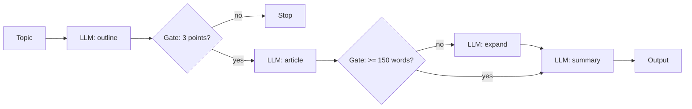

# Pattern 1: Prompt Chaining

**File:** [`prompt-chaining.js`](../prompt-chaining.js) · **Log:** [`logs/prompt-chaining.log`](../logs/prompt-chaining.log)

## What it is
A task is split into a fixed sequence of LLM calls. Each call takes the previous call's output as its input. Programmatic **gates** between steps check the intermediate result, so a bad step stops the chain or gets fixed before it affects the next one.

## When to use it
- The task breaks cleanly into known, ordered subtasks.
- You're willing to trade some latency for accuracy, since each call has an easier job.
- Intermediate outputs can be checked with simple code (length, format, required fields).

## Flow


## Implementation
| Step | What happens |
|---|---|
| 1. Outline | `ask()` generates a 3-point outline on "AI Agents". |
| Gate 1 | Counts numbered lines with a regex. Fewer than 3 throws an error and stops the chain. |
| 2. Article | The outline is placed in the prompt to write a ~250-word article. |
| Gate 2 | Word count check. If it's under 150 words, one extra "expand" call runs. |
| 3. Summary | The article is summarized in 2 sentences. |

The gates are plain JavaScript, not LLM calls. They're cheap and deterministic, which is the point of gating.

## Run
```bash
npm run chaining
```

## Observations
- Each step's prompt is small and focused, so outputs stay on-topic.
- Errors compound: a weak outline produces a weak article. The gate catches structural problems (a missing point) but not quality problems. That needs the evaluator-optimizer pattern.
- Latency is the sum of all steps because nothing runs in parallel.

## Result from the logged run
Outline gate passed (3 points), article gate passed (296 words, so no expand call was needed), 2-sentence summary produced. 3 LLM calls, 6.4s. See [the log](../logs/prompt-chaining.log).
