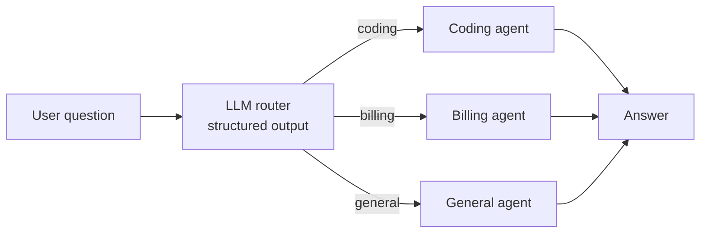

# Pattern 2: Routing

**File:** [`routing.js`](../routing.js) · **Log:** [`logs/routing.log`](../logs/routing.log)

## What it is
A classifier looks at the input and sends it to one of several **specialized handlers**. Each handler has its own system prompt tuned for that kind of request. This keeps the handlers separate, so tuning one doesn't hurt the others.

## When to use it
- Inputs fall into distinct categories that are better handled separately.
- Classification can be done reliably (by an LLM or a traditional classifier).
- You want to send simple requests to cheaper paths and hard ones to stronger ones.

## Flow


## Implementation
- The router uses `askObject()` with a zod schema: `category` (enum `coding | billing | general`), `confidence`, and `reasoning`. Structured output guarantees the router returns one of the valid routes. There's no free-text parsing.
- `ROUTES` maps each category to a specialist system prompt.
- Three sample questions (one per category) run through the router to show each route being taken.

### Change from the first version
The first version routed on `question.includes("SQL") || question.includes("Python")`. That's brittle: "How do I reverse a linked list?" is a coding question but would go to the general agent. The LLM classifier routes by meaning, and the logged `reasoning` shows *why* each route was picked.

## Run
```bash
npm run routing
```

## Observations
- Logging the router's reasoning makes misroutes easy to debug.
- Routing adds one extra LLM call per request, which is the cost of specialization.
- A low `confidence` value could trigger a fallback to the general agent or a human. That's a natural next step.
