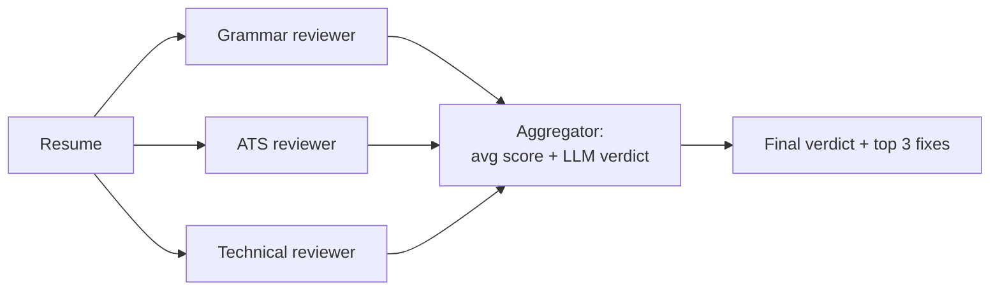

# Pattern 3: Parallelization

**File:** [`parallelization.js`](../parallelization.js) · **Log:** [`logs/parallelization.log`](../logs/parallelization.log)

## What it is
Several independent LLM calls run **at the same time**, and their results are combined in code or by another LLM. There are two variants:
- **Sectioning:** split a task into independent parts (used here).
- **Voting:** run the same task several times and compare the answers.

## When to use it
- Subtasks don't depend on each other, so they can run concurrently for speed.
- Each aspect needs focused attention. One prompt checking grammar *and* ATS *and* skills tends to do all three worse.

## Flow


## Implementation
- A sample Data Analyst resume is reviewed by three reviewers. Each has its own system prompt and returns structured output: `score`, `strengths[]`, `issues[]`.
- `Promise.all` runs all three at once. The log prints when each reviewer finishes and the total wall-clock time, which shows they overlap instead of running one after another.
- **Aggregation** happens in two stages: the average score is computed in code, then an LLM combines all findings into a final verdict and the top 3 prioritized fixes.

### Change from the first version
The first version ran the three calls in parallel but only printed the raw array. Nothing combined the results, and a real parallelization workflow needs that aggregation step.

## Run
```bash
npm run parallel
```

## Observations
- Total time ≈ the slowest reviewer plus the aggregator, not the sum of all three.
- Structured output made aggregation trivial. Averaging free-text reviews would need another parsing step.
- Reviewers sometimes flag the same issue from different angles. The aggregator removes the duplicates.
