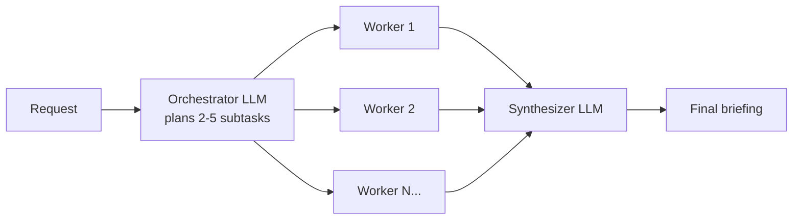

# Pattern 4: Orchestrator-Workers

**File:** [`orchestrator.js`](../orchestrator.js) · **Log:** [`logs/orchestrator.log`](../logs/orchestrator.log)

## What it is
A central **orchestrator** LLM reads the request and decides *at runtime* which subtasks are needed. **Worker** LLMs complete each subtask, and a **synthesizer** combines their results. The key difference from parallelization: the subtasks are **not hard-coded**. The orchestrator plans them, and a different request would get a different plan.

## When to use it
- You can't predict the subtasks in advance (research reports, multi-file code changes).
- The work splits into specialist pieces that can run independently once planned.

## Flow


## Implementation
- Request: *"Prepare a short investment briefing on Tesla for a retail investor."*
- **Orchestrator:** `askObject()` with a zod schema returns `subtasks[]` (2–5 items, each with `title` + `instructions`). The plan is printed to the log.
- **Workers:** one `ask()` per planned subtask, run in parallel with `Promise.all`. Each worker's system prompt limits it to that subtask.
- **Synthesizer:** combines all worker sections into one briefing with an overall takeaway.

### Change from the first version
The first version hard-coded three calls (market, finance, risk), ran them **one after another**, and then combined them. That's closer to prompt chaining. There was no orchestrator deciding the work. Now the LLM plans the subtasks and the workers run in parallel.

## Run
```bash
npm run orchestrator
```

## Observations
- The plan changes between runs and requests. That flexibility is the point, but it also makes this pattern less predictable than a fixed workflow.
- Bounding the plan (`min(2).max(5)`) keeps cost and latency under control.
- The workers aren't given live data, so figures in the briefing come from the model's training data and aren't current. A real system would give workers tools (search, a market-data API).
