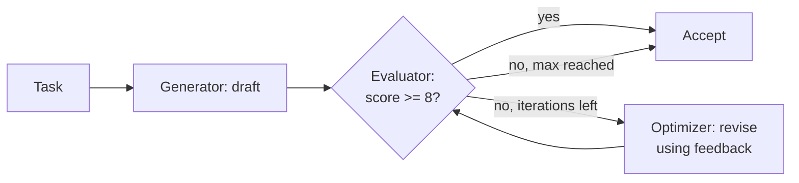

# Pattern 5: Evaluator-Optimizer

**File:** [`evaluator.js`](../evaluator.js) · **Log:** [`logs/evaluator.log`](../logs/evaluator.log)

## What it is
One LLM (the **generator/optimizer**) produces output, and another LLM call (the **evaluator**) scores it against explicit criteria and gives feedback. The generator revises using that feedback, and the loop repeats until the evaluator accepts the draft or an iteration limit is reached.

## When to use it
- You have clear evaluation criteria.
- Iterative feedback noticeably improves the result, the way a human editor's feedback would.

## Flow


## Implementation
- Task: a ~120-word article explaining AI agents to a non-technical manager.
- The first draft is **deliberately weak** (vague, hype-filled, no example). This keeps your original "write a bad article" idea and gives the loop something to fix.
- **Evaluator:** `askObject()` returns `score` (1–10), `passes`, and a `feedback[]` list, scored against four explicit criteria: accuracy, clarity, one concrete example, and length.
- **Loop:** stops when `passes && score >= 8`, or after `MAX_ITERATIONS = 3`. The code double-checks the score threshold and doesn't rely only on the model's `passes` flag.
- Each iteration's score and feedback are logged, so the improvement is visible.

### Change from the first version
The first version made exactly one evaluate→improve pass and never checked whether the result got better. There was no loop and no stopping condition, and those are what define this pattern.

## Run
```bash
npm run evaluator
```

## Observations
- The score going up across iterations in the log is the evidence that the loop works.
- Explicit criteria matter. Without them the evaluator gives generic feedback.
- The evaluator is an LLM too, so it can be lenient. The hard iteration cap stops the loop from running forever and caps cost.

## Result from the logged run
Iteration 1: the weak draft scored **2/10** (`passes=false`) with specific feedback on hype, jargon, and the missing example. After one revision, iteration 2 scored **10/10** and was accepted, so the loop stopped early instead of using all 3 iterations. 4 LLM calls, 15.4s. See [the log](../logs/evaluator.log).
